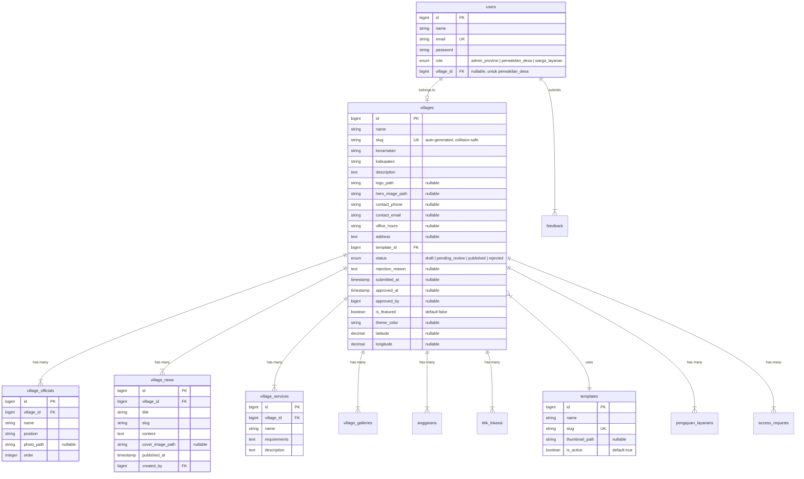

<
- [Latar Belakang](#-latar-belakang)
- [Fitur Utama](#-fitur-utama)
- [Arsitektur & Tech Stack](#-arsitektur--tech-stack)
- [Struktur Direktori](#-struktur-direktori)
- [Skema Database](#-skema-database)
- [Alur Bisnis](#-alur-bisnis)
- [Prasyarat](#-prasyarat)
- [Instalasi & Menjalankan](#-instalasi--menjalankan)
- [Kredensial Akun Demo](#-kredensial-akun-demo)
- [Skenario Demo (Walkthrough)](#-skenario-demo-walkthrough)
- [Pengujian (Testing)](#-pengujian-testing)
- [Screenshots](#-screenshots)
- [Konvensi Kode](#-konvensi-kode)
- [Lisensi](#-lisensi)

---

## 🏠 Tentang Proyek

**Portal Desa** adalah platform *"SaaS internal"* yang memungkinkan perwakilan desa/kelurahan di Provinsi Jawa Timur untuk membuat halaman web resmi desa mereka secara mandiri (*self-service*) — **tanpa perlu menulis kode satu baris pun**.

Cukup dengan mendaftar, mengisi form wizard 4 langkah, memilih template, dan menunggu persetujuan admin, maka halaman publik desa langsung tersedia di URL `/desa/{slug}`.

> **Catatan:** Proyek ini merupakan **purwarupa (prototype) akademik** untuk syarat konversi SKS magang, bukan produk yang akan langsung di-deploy ke domain publik. Semua akses menggunakan localhost.

---

## 🎓 Latar Belakang

| Item | Detail |
|---|---|
| **Jenis** | Purwarupa akademik — syarat konversi SKS magang |
| **Instansi Mitra** | Bidang Aplikasi Informatika, Diskominfo Provinsi Jawa Timur |
| **Tujuan** | Membuktikan konsep platform pembuatan website desa secara self-service |
| **Cakupan** | Demo localhost dengan beberapa desa contoh (data dummy/seed) |
| **Mode Akses** | Path-based (`/desa/{slug}`), bukan subdomain |

---

## ✨ Fitur Utama

### 🧙 Self-Service Onboarding (Wizard 4 Langkah)
Perwakilan desa mendaftar dan mengisi data melalui wizard interaktif:
1. **Data Dasar** — Nama desa, kecamatan, kabupaten, deskripsi
2. **Pilih Template** — Klasik atau Modern (dengan preview visual)
3. **Upload Media** — Logo desa, foto hero, dan media lainnya
4. **Perangkat Desa** — Struktur organisasi dan jabatan

### 🔐 Sistem Approval Admin
- Admin Provinsi meninjau setiap pendaftaran baru
- Fitur *Approve* (terbitkan) atau *Reject* (tolak dengan alasan)
- Preview halaman desa sebelum disetujui
- Notifikasi otomatis ke perwakilan desa

### 🎨 Template System
- 2 template siap pakai: **Klasik** dan **Modern**
- Satu controller (`VillagePageController`) me-render tampilan berdasarkan template yang dipilih
- Setiap template memiliki layout dan nuansa visual berbeda

### 📰 Manajemen Konten (Pasca-Publish)
Setelah desa disetujui, perwakilan desa dapat langsung mengelola:
- **Profil Desa** — Edit info kontak, alamat, jam operasional
- **Berita Desa** — Buat, edit, hapus artikel berita
- **Perangkat Desa** — Tambah/edit struktur organisasi
- **Layanan Administrasi** — Direktori layanan publik desa
- **Galeri Foto** — Upload dan kelola foto kegiatan
- **Peta Interaktif** — Titik lokasi penting di desa (dengan koordinat)
- **Transparansi Anggaran (APBDes)** — Input dan publikasi data anggaran

> **Penting:** Pembaruan konten langsung tayang tanpa perlu approval ulang — approval hanya untuk penerbitan pertama kali.

### 👥 Multi-Role Access
| Role | Kemampuan |
|---|---|
| `admin_provinsi` | Approve/reject pendaftaran, monitoring adopsi, kelola template, review feedback |
| `perwakilan_desa` | Isi wizard, kelola konten desa, kelola operator |
| `warga_layanan` | Ajukan permohonan layanan administrasi desa |
| Publik (tanpa login) | Akses halaman `/desa/{slug}` yang sudah `published` |

### 📊 Fitur Tambahan
- **Dashboard Admin** — Statistik adopsi, antrean review, monitoring desa
- **Sistem Feedback** — Pengunjung bisa mengirim masukan
- **Request Akses Warga** — Warga bisa mendaftar ke desa tertentu
- **Pengajuan Layanan** — Warga mengajukan layanan administrasi secara online
- **Ekspor PDF APBDes** — Cetak laporan anggaran dalam format PDF

---

## 🏗 Arsitektur & Tech Stack

```
┌─────────────────────────────────────────────────────────────┐
│                        BROWSER                              │
│  Landing Page ─── Auth ─── Wizard ─── Dashboard ─── Publik  │
└────────────────────────┬────────────────────────────────────┘
                         │  HTTP
┌────────────────────────▼────────────────────────────────────┐
│                   LARAVEL 12 (Backend)                       │
│                                                              │
│  Routes (web.php)                                            │
│    ├── Public    → LandingPageController, VillagePageController│
│    ├── Auth      → Breeze (Login, Register)                  │
│    ├── Wizard    → WizardController (4 steps + review)       │
│    ├── Desa      → DashboardController, GalleryController,   │
│    │               AnggaranController, TitikLokasiController  │
│    ├── Admin     → AdminDashboardController, MonitoringController│
│    └── Layanan   → PengajuanController                       │
│                                                              │
│  Services                                                    │
│    ├── VillageRegistrationService (slug, validation, commit) │
│    └── SuratGeneratorService (PDF generation)                │
│                                                              │
│  Middleware                                                   │
│    ├── EnsureUserIsAdmin                                     │
│    ├── EnsureUserIsPerwakilanDesa                            │
│    └── EnsureWargaLayananAccess                              │
│                                                              │
│  Views (Blade + Tailwind CSS 4 + Alpine.js)                  │
│    ├── welcome.blade.php (landing page)                      │
│    ├── wizard/ (step1–4, review)                             │
│    ├── village/templates/ (klasik, modern)                   │
│    ├── admin/ (dashboard, review, monitoring)                │
│    ├── desa/ (CRUD konten desa)                              │
│    └── layanan/ (pengajuan layanan warga)                    │
└────────────────────────┬────────────────────────────────────┘
                         │
┌────────────────────────▼────────────────────────────────────┐
│                    MySQL 8 Database                          │
│  users, villages, templates, village_officials,              │
│  village_news, village_services, village_galleries,           │
│  anggarans, titik_lokasis, pengajuan_layanans, feedback      │
└─────────────────────────────────────────────────────────────┘
```

### Tech Stack Detail

| Layer | Teknologi | Versi |
|---|---|---|
| **Backend** | Laravel (PHP) | 12.x (PHP 8.2+) |
| **Database** | MySQL | 8.0 |
| **Auth** | Laravel Breeze | 2.x |
| **Frontend** | Blade + Tailwind CSS + Alpine.js | TW 4.0, Alpine 3.x |
| **Build Tool** | Vite | 7.x |
| **PDF Export** | barryvdh/laravel-dompdf | 3.x |
| **SEO** | spatie/laravel-sitemap | 8.x |
| **Testing** | Pest (PHPUnit) | 3.x |
| **Linting** | Laravel Pint (PSR-12) | 1.x |
| **Multi-tenant** | Path-based routing (`/desa/{slug}`) | — |

---

## 📁 Struktur Direktori

```
portal_desa/
├── app/
│   ├── Http/
│   │   ├── Controllers/
│   │   │   ├── Admin/                    # Controller untuk Admin Provinsi
│   │   │   │   ├── DashboardController   #   Dashboard, approve/reject, preview
│   │   │   │   ├── MonitoringController  #   Monitoring & statistik adopsi
│   │   │   │   ├── FeedbackController    #   Kelola feedback masuk
│   │   │   │   └── AccessRequestReviewController  # Review request akses warga
│   │   │   ├── Desa/                     # Controller untuk Perwakilan Desa
│   │   │   │   ├── DashboardController   #   CRUD profil, officials, news, services
│   │   │   │   ├── GalleryController     #   Kelola galeri foto
│   │   │   │   ├── AnggaranController    #   Kelola data APBDes
│   │   │   │   ├── TitikLokasiController #   Kelola peta interaktif
│   │   │   │   ├── OperatorController    #   Kelola akun operator desa
│   │   │   │   └── PengajuanMasukController  # Pengajuan layanan masuk
│   │   │   ├── Layanan/                  # Controller untuk Warga Layanan
│   │   │   ├── WizardController          # Wizard pendaftaran desa (4 steps)
│   │   │   ├── VillagePageController     # Render halaman publik desa
│   │   │   ├── LandingPageController     # Halaman beranda
│   │   │   └── ApbdesController          # Halaman publik APBDes + export PDF
│   │   ├── Middleware/                   # Role-based access control
│   │   └── Requests/                     # Form request validation
│   ├── Models/                           # Eloquent models (13 model)
│   ├── Services/                         # Business logic layer
│   │   ├── VillageRegistrationService    #   Slug generation, wizard commit
│   │   └── SuratGeneratorService         #   Generate surat/dokumen PDF
│   ├── Notifications/                    # Notifikasi sistem
│   └── Observers/                        # Model observers
├── database/
│   ├── migrations/                       # 23 file migration
│   ├── seeders/                          # Demo data seeder
│   │   ├── DatabaseSeeder                #   Orchestrator
│   │   ├── TemplateSeeder                #   Seed 2 template (Klasik, Modern)
│   │   ├── VillageSeeder                 #   Seed desa demo (4 status)
│   │   └── demo-images/                  #   Gambar placeholder untuk seed
│   └── factories/                        # Model factories untuk testing
├── resources/views/
│   ├── welcome.blade.php                 # Landing page
│   ├── dashboard.blade.php               # Dashboard perwakilan desa
│   ├── wizard/                           # Form wizard 4 langkah + review
│   ├── admin/                            # View admin (dashboard, review, monitoring)
│   ├── desa/                             # View kelola konten desa
│   ├── village/templates/                # Template halaman publik desa
│   │   ├── klasik.blade.php              #   Template gaya klasik
│   │   └── modern.blade.php              #   Template gaya modern
│   ├── layanan/                          # View pengajuan layanan
│   ├── layouts/                          # Layout utama (app, guest)
│   └── components/                       # Blade components reusable
├── routes/
│   ├── web.php                           # Semua route web (167 baris)
│   └── auth.php                          # Route autentikasi (Breeze)
├── tests/
│   ├── Feature/                          # 9 test suite
│   │   ├── SlugGenerationTest            #   Uji slug unik & collision
│   │   ├── PublicVillagePageTest          #   Uji akses publik berdasarkan status
│   │   ├── AdminApprovalTest             #   Uji approve/reject workflow
│   │   ├── VillageAuthorizationTest      #   Uji otorisasi lintas-desa
│   │   └── ...                           #   dan lainnya
│   └── Unit/                             # Unit tests
├── AGENTS.md                             # Konteks untuk agentic coding
├── DESIGN.md                             # Dokumen desain sistem
├── FLOW.md                               # Dokumen alur bisnis
└── README.md                             # ← Anda sedang membaca ini
```

---

## 🗄 Skema Database



### Tabel Pendukung
| Tabel | Fungsi |
|---|---|
| `village_galleries` | Foto galeri kegiatan desa |
| `anggarans` | Data anggaran APBDes per tahun |
| `titik_lokasis` | Titik-titik lokasi penting pada peta desa |
| `pengajuan_layanans` | Pengajuan layanan administrasi dari warga |
| `pengajuan_layanan_dokumens` | Dokumen pendukung pengajuan |
| `access_requests` | Permintaan akses warga ke desa |
| `feedback` | Masukan/saran dari pengunjung |
| `notifications` | Notifikasi sistem |

---

## 🔄 Alur Bisnis

```
┌─────────────────────────────────────────────────────────┐
│                    ALUR PENDAFTARAN DESA                 │
└─────────────────────────────────────────────────────────┘

  Perwakilan Desa                Admin Provinsi              Publik
  ───────────────                ──────────────              ──────
        │
        ▼
  ┌─────────────┐
  │  Registrasi │
  │  Akun Baru  │
  └──────┬──────┘
         │
         ▼
  ┌─────────────────────────────────────┐
  │      WIZARD PENDAFTARAN (4 Step)     │
  │                                      │
  │  Step 1: Data Dasar Desa            │
  │  Step 2: Pilih Template + Upload    │
  │  Step 3: Media (Logo, Hero Image)   │
  │  Step 4: Input Perangkat Desa       │
  │                                      │
  │  📌 Data disimpan di SESSION         │
  │     (belum commit ke database)       │
  └──────────────┬──────────────────────┘
                 │
                 ▼
  ┌─────────────────────┐
  │   Review & Submit    │──────────────────────┐
  │   status: pending    │                      │
  └─────────────────────┘                      ▼
                                    ┌───────────────────┐
                                    │   Antrean Review   │
                                    │   (Admin Dashboard)│
                                    └────────┬──────────┘
                                             │
                                    ┌────────┴────────┐
                                    ▼                 ▼
                              ┌──────────┐     ┌──────────┐
                              │ APPROVE  │     │  REJECT  │
                              │ published│     │ rejected │
                              └────┬─────┘     └────┬─────┘
                                   │                 │
                                   │                 ▼
                                   │          Perwakilan Desa
                                   │          bisa revisi &
                                   │          submit ulang
                                   ▼
                            ┌──────────────┐
                            │ Halaman Publik│────▶  /desa/{slug}
                            │  LIVE 🟢     │       bisa diakses publik
                            └──────┬───────┘
                                   │
                                   ▼
                            Perwakilan Desa
                            bisa update konten
                            TANPA approval ulang
```

### Ringkasan Aturan Bisnis

1. **Wizard data disimpan di session** — Baru di-commit ke database saat submit final (bukan per-step).
2. **Slug otomatis dari nama desa** — `"Ladang Panjang"` → `ladang-panjang`. Jika sudah ada, otomatis ditambah angka: `ladang-panjang-2`.
3. **Approval hanya untuk publish pertama** — Setelah `published`, update konten langsung tayang.
4. **Satu akun = satu desa** — Perwakilan desa tidak bisa mengakses data desa lain.
5. **Hanya desa `published`** yang bisa diakses publik di `/desa/{slug}`.

---

## 📋 Prasyarat

Pastikan sistem Anda sudah terinstal:

| Software | Versi Minimum | Cek Versi |
|---|---|---|
| PHP | 8.2+ | `php -v` |
| Composer | 2.x | `composer -V` |
| MySQL | 8.0 | `mysql --version` |
| Node.js | 18+ | `node -v` |
| npm | 9+ | `npm -v` |

Ekstensi PHP yang diperlukan:
```
pdo_mysql, mbstring, openssl, tokenizer, xml, ctype, json, bcmath, fileinfo, gd
```

---

## 🚀 Instalasi & Menjalankan

### 1️⃣ Clone & Install Dependencies

```bash
git clone <repo-url>
cd portal_desa
composer install
npm install
```

### 2️⃣ Konfigurasi Environment

```bash
cp .env.example .env
php artisan key:generate
```

Edit file `.env` dan sesuaikan konfigurasi database:

```env
DB_CONNECTION=mysql
DB_HOST=127.0.0.1
DB_PORT=3306
DB_DATABASE=portal_desa
DB_USERNAME=root
DB_PASSWORD=
```

### 3️⃣ Buat Database & Migrate + Seed

```bash
# Buat database di MySQL terlebih dahulu
mysql -u root -e "CREATE DATABASE portal_desa;"

# Jalankan migrasi dan seed data demo
php artisan migrate --seed
```

### 4️⃣ Buat Symbolic Link untuk Storage

```bash
php artisan storage:link
```

> Ini penting agar gambar (logo, foto) yang di-upload bisa diakses dari browser.

### 5️⃣ Build Asset Frontend

```bash
npm run build
```

### 6️⃣ Jalankan Aplikasi

```bash
php artisan serve
```

Buka **http://localhost:8000** di browser Anda. 🎉

### ⚡ Quick Start (Satu Perintah)

Alternatif, gunakan Composer script untuk menjalankan server + Vite secara bersamaan:

```bash
composer dev
```

> Ini menjalankan `php artisan serve`, `php artisan queue:listen`, dan `npm run dev` secara paralel.

---

## 🔑 Kredensial Akun Demo

Seeder menyediakan beberapa akun siap pakai untuk demo. **Password semua akun: `password`**

| Role | Email | Status Desa | Kegunaan Demo |
|---|---|---|---|
| **Admin Provinsi** | `admin@jatimprov.go.id` | — | Approve/reject, monitoring, review feedback |
| **Desa (Draft)** | `draft@desa.id` | `draft` | Melanjutkan pengisian wizard |
| **Desa (Pending)** | `pending@desa.id` | `pending_review` | Melihat status menunggu review |
| **Desa (Published)** | `published@desa.id` | `published` | Mengelola konten (berita, perangkat, dll.) |
| **Desa (Rejected)** | `rejected@desa.id` | `rejected` | Melihat alasan penolakan & revisi ulang |

---

## 📖 Skenario Demo (Walkthrough)

### 🟢 Alur 1: Pendaftaran Desa Baru

1. Buka `http://localhost:8000` → klik **"Mulai Gratis Sekarang"** atau **"Daftar"**
2. Buat akun baru (contoh: `desa-baru@gmail.com`)
3. Masuk ke **Wizard Pendaftaran** → isi 4 langkah:
   - **Step 1:** Nama desa, kecamatan, kabupaten, deskripsi
   - **Step 2:** Pilih template (Klasik/Modern), upload logo & hero image
   - **Step 3:** Media tambahan dan pengaturan
   - **Step 4:** Input data perangkat desa (nama, jabatan, foto)
4. Review semua data → klik **"Kirim untuk Ditinjau"**
5. Status berubah menjadi `pending_review`

### 🔵 Alur 2: Review oleh Admin Provinsi

1. Logout → Login sebagai Admin: `admin@jatimprov.go.id` / `password`
2. Buka **Dashboard Admin** → lihat tabel **"Antrean Menunggu Review"**
3. Klik **"Review"** pada desa yang baru didaftarkan
4. Lihat detail data desa → klik **"Lihat Preview Halaman"** untuk pratinjau
5. Klik **"Setujui & Tayangkan"** → status berubah ke `published`
6. *(Atau klik "Tolak" dengan mengisi alasan penolakan)*

### 🟡 Alur 3: Pengelolaan Konten (Pasca-Publish)

1. Logout → Login sebagai desa yang sudah di-approve *(atau pakai `published@desa.id`)*
2. Dashboard menampilkan menu pengelolaan:
   - 📰 **Berita** — Tambah artikel baru
   - 👥 **Perangkat Desa** — Edit struktur organisasi
   - 📋 **Layanan** — Tambah layanan administrasi
   - 🖼️ **Galeri** — Upload foto kegiatan
   - 📍 **Peta** — Tandai lokasi penting di desa
   - 💰 **Anggaran** — Input data APBDes
3. Semua perubahan langsung tayang tanpa approval ulang ✅

### 🟣 Alur 4: Halaman Publik Desa

1. Kunjungi `http://localhost:8000/desa/{slug}` *(slug bisa dilihat di dashboard)*
2. Halaman di-render sesuai template yang dipilih (Klasik/Modern)
3. Verifikasi perubahan konten dari Alur 3 sudah langsung tampil
4. Halaman juga menampilkan: APBDes, peta interaktif, galeri, berita, dll.

---

## 🧪 Pengujian (Testing)

Proyek ini menggunakan **Pest** (di atas PHPUnit) dengan 9 test suite:

```bash
# Jalankan semua test
php artisan test

# Atau gunakan Pest langsung
./vendor/bin/pest
```

### Test Suite yang Tersedia

| Test File | Yang Diuji |
|---|---|
| `SlugGenerationTest` | Slug otomatis unik, termasuk collision handling |
| `PublicVillagePageTest` | Desa `draft`/`pending`/`rejected` → 404; `published` → 200 |
| `AdminApprovalTest` | Approve mengisi `approved_at`/`approved_by`; Reject wajib `rejection_reason` |
| `VillageAuthorizationTest` | Perwakilan desa TIDAK bisa edit desa lain |
| `AdminMonitoringTest` | Fitur monitoring & statistik admin |
| `NotificationTest` | Notifikasi otomatis saat approve/reject |
| `FeedbackTest` | Sistem feedback dari pengunjung |
| `ProfileTest` | Update profil pengguna |

### Quick Test

```bash
# Test spesifik file
php artisan test --filter=SlugGenerationTest

# Test dengan output verbose
php artisan test --verbose
```

---

## 📸 Screenshots

> *Untuk melihat tampilan aplikasi, jalankan proyek secara lokal menggunakan instruksi instalasi di atas.*

**Halaman yang bisa dieksplorasi:**

| URL | Halaman |
|---|---|
| `/` | Landing page Portal Desa |
| `/login` | Halaman login |
| `/register` | Halaman registrasi |
| `/dashboard` | Dashboard (sesuai role) |
| `/wizard/step-1` | Wizard pendaftaran (perwakilan desa) |
| `/admin/dashboard` | Dashboard admin provinsi |
| `/desa/{slug}` | Halaman publik desa |
| `/desa/{slug}/apbdes` | Transparansi anggaran desa |

---

## 📐 Konvensi Kode

| Aturan | Keterangan |
|---|---|
| **Standar** | PSR-12 (dijalankan via Laravel Pint) |
| **Bahasa kode** | Inggris (nama file, class, method, variabel) |
| **Bahasa UI** | Bahasa Indonesia (label, teks, pesan) |
| **Business logic** | Di Service class, bukan di Controller |
| **Template rendering** | Satu `VillagePageController` yang resolve Blade view berdasarkan `template.slug` |
| **Wizard session** | Data wizard disimpan di session, commit ke DB sekali di step terakhir |
| **Slug generation** | Di `VillageRegistrationService`, bukan di controller |

### Linting

```bash
# Format kode sesuai PSR-12
./vendor/bin/pint
```

---

## 📄 Lisensi

Proyek ini dilisensikan di bawah [MIT License](https://opensource.org/licenses/MIT).

---

<p align="center">
  <em>Dibangun dengan ❤️ menggunakan Laravel 12 · Blade · Tailwind CSS 4 · Alpine.js</em><br>
  <em>Bidang Aplikasi Informatika — Diskominfo Provinsi Jawa Timur</em>
</p>
]]>
